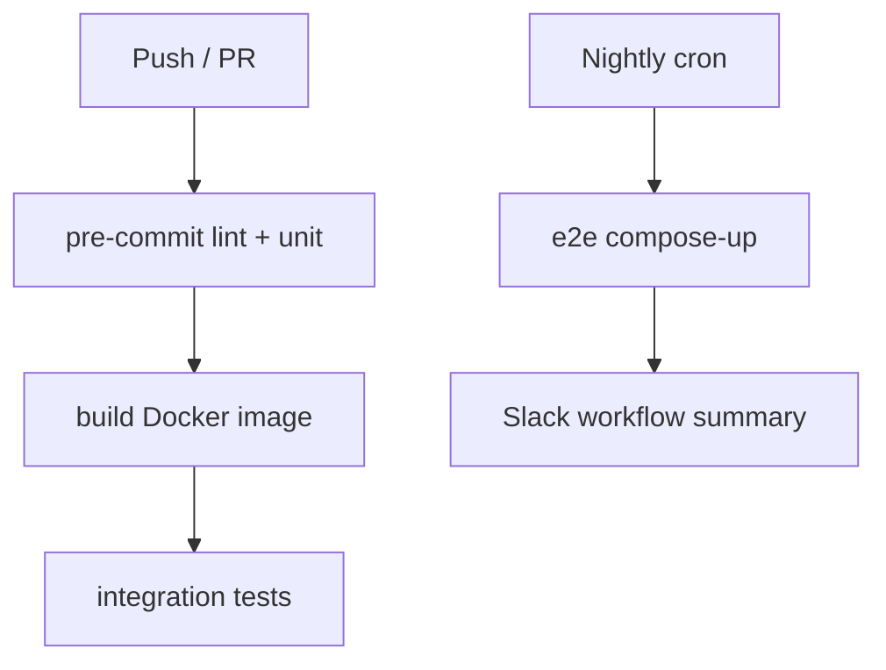

# AGENTS.md – Writing and Running a PromptYoSelf Agent

This document is aimed at **agent authors**—developers who want their computational beings to receive reminders from the PromptYoSelf scheduler *and* create new ones for themselves. Everything here relies on the local **STDIO JSON‑RPC** contract; HTTP webhooks are optional.

> **TL;DR**
>
> * Write a Python script that reads newline‑delimited JSON‑RPC objects from **stdin** and writes responses to **stdout**.
> * Implement at minimum the `reminder.fire` handler (receive prompts) and optionally use `reminders.create` to schedule future prompts.

---

## 1 · Agent lifecycle

| Step | Who acts?                                                                | Message                                                   |
| ---- | ------------------------------------------------------------------------ | --------------------------------------------------------- |
| 1    | **Scheduler** spawns agent via `subprocess.Popen([process_name])`.       | —                                                         |
| 2    | **Scheduler** sends a JSON‑RPC notification each time a reminder is due. | `{"jsonrpc":"2.0","method":"reminder.fire","params":{…}}` |
| 3    | **Agent** performs the task, then replies with an ACK.                   | `{"jsonrpc":"2.0","result":"ok","id":null}`               |
| 4    | **Agent** (optional) schedules its own next prompt.                      | `reminders.create` RPC request                            |
| 5    | **Scheduler** responds with the new reminder ID.                         | `{"result":{"id":"rem_abc"},"id":42}`                     |

Notes:

* JSON messages **must be newline‑terminated** (`\n`).
* The scheduler keeps the pipe open; reuse the same process for multiple reminders.

---

## 2 · JSON‑RPC methods

### 2.1 `reminder.fire`

Sent **host ➜ agent**. Notification (no `id`).

| Field         | Type                    | Description                  |
| ------------- | ----------------------- | ---------------------------- |
| `reminder_id` | string                  | UUID primary key             |
| `title`       | string                  | Human/agent‑readable summary |
| `description` | string \| null          | Long text                    |
| `due_date`    | ISO‑8601                | Scheduled execution time     |
| `project_id`  | string \| null          | Optional grouping            |
| `priority`    | `low \| medium \| high` | Mirrors task priority        |

### 2.2 `reminders.create`

**Agent ➜ host**. Request. Returns `id` of newly created reminder.

| Param          | Type               | Example                         |
| -------------- | ------------------ | ------------------------------- |
| `title`        | string             | "Self‑review"                   |
| `when`         | ISO‑8601 timestamp | "2025‑06‑01T09:00:00Z"          |
| `rrule`        | string \| null     | `FREQ=DAILY;BYHOUR=18`          |
| `webhook_url`  | string \| null     | `http://localhost:8070/agent/7` |
| `process_name` | string \| null     | Defaults to current binary      |

---

## 3 · Example agent (Python ≤ 50 LOC)

```python
#!/usr/bin/env python3
import sys, json, uuid, sys

def send(obj):
    sys.stdout.write(json.dumps(obj) + "\n")
    sys.stdout.flush()

for line in sys.stdin:
    try:
        msg = json.loads(line)
    except json.JSONDecodeError:
        continue  # ignore garbage

    if msg.get("method") == "reminder.fire":
        params = msg["params"]
        print(f"🔥  {params['title']} (due {params['due_date']})", file=sys.stderr)
        # ACK back
        send({"jsonrpc": "2.0", "result": "ok", "id": msg.get("id")})
        # Schedule follow‑up in one hour
        send({
            "jsonrpc": "2.0",
            "id": str(uuid.uuid4()),
            "method": "reminders.create",
            "params": {
                "title": f"Follow‑up for {params['title']}",
                "when": params["due_date"].replace("Z", ""),
                "rrule": None
            }
        })
```

Save as `agents/echo_agent.py`, `chmod +x`, then reference it in a reminder’s `process_name`.

---

## 4 · Testing your agent locally

```bash
# run scheduler in one terminal (make dev or flask run)

# in another terminal, inject a reminder via CLI helper
prompty reminders create \
  --title "Ping agent" \
  --when "$(date -u --iso-8601=seconds --date='+30 seconds')" \
  --process-name "agents/echo_agent.py"

# watch the first terminal: you should see STDIO traffic and ACK logs.
```

---

## 5 · Troubleshooting

| Symptom                           | Likely cause         | Fix                                                  |
| --------------------------------- | -------------------- | ---------------------------------------------------- |
| Scheduler logs “broken pipe”      | Agent crashed        | Check agent stderr; restart after fixing.            |
| Reminder never flips to *sent*    | Agent didn’t ACK     | Ensure you write `{… "result":"ok" …}` with newline. |
| Agent schedules but nothing fires | `process_name` empty | Provide explicit name or keep default within params. |

---

## 6 · Future extensions

* **Webhooks** – include `webhook_url` in `reminders.create`; scheduler will POST payload at fire‑time.
* **Event streaming** – if we later enable htmx + SSE, agents can subscribe to `/events`.
* **Remote agents** – roadmap includes JWT‑protected `/api/reminders` so agents outside the host can still create prompts.

---

## 7 · Testing strategy

| Tier            | What it covers                                                      | Tools & location                                                            | Pass/fail rule (CI gate)                                                    |
| --------------- | ------------------------------------------------------------------- | --------------------------------------------------------------------------- | --------------------------------------------------------------------------- |
| **Unit**        | Single function/class; no I/O                                       | `tests/unit/` & `pytest` with  **pytest-cov**                               | 100 % of code touched by PR must have unit tests; repo‐wide coverage ≥ 85 % |
| **Integration** | Real DB, scheduler, STDIO agent; but Flask test-client (no network) | `tests/integration/` – uses **pytest-flask**, **factory-boy** fixtures      | All integrations green; set `pytest -m "integration and not slow"` in CI    |
| **End-to-End**  | Docker-compose up → "create reminder" → agent ACK visible in UI     | `tests/e2e/` – **playwright** (headless Chromium); runs in nightly workflow | ≥ 90 % critical flows must pass; flaky tests auto-quarantined               |
| **Smoke**       | "Does the container boot?"; migrations, version output              | Shell script called from **setup.sh** (already in canvas)                   | Failure blocks merge                                                        |

**Practices**

* **One test file mirrors one app module** – e.g., `app/models.py` → `tests/unit/test_models.py`
* **Factories** – Use `factory_boy` for `ProjectFactory`, `ReminderFactory` so fixtures stay DRY.
* **Database** – `pytest.fixture(scope="function")` spins up a SQLite file in `/tmp`, rolls back after each test.
* **Markers** – Tag anything that takes > 1 s with `@pytest.mark.slow` so devs can skip locally.
* **Coverage fail-under** – `pytest --cov --cov-fail-under=85`, enforced in GitHub Actions.
* **Pre-commit hook** – `pytest -q` runs on staged code for instant feedback.

---

## 8 · CI / CD flow (GitHub Actions)



1. **PR workflow** — lint (ruff), unit + integration, coverage check, image build; blocks merge on failure.
2. **Nightly workflow** — brings up `docker-compose`, seeds demo data, runs Playwright suite, pushes artefacts (screenshots, logs) to run summary.
3. **Release workflow** (tag push) — builds multi-arch image, runs smoke test, publishes to GHCR, updates MkDocs site.

---

## 9 · Documentation architecture  (*"Everything in one place"*)

```
docs/
│
├── index.md           ← landing page / project pitch
├── quickstart.md      ← 5-minute local run (uses devcontainer)
├── how-to/
│   ├── add-job.md
│   └── write-tests.md
├── reference/
│   ├── api.md         ← auto-generated OpenAPI table
│   └── scheduler.md
├── adr/               ← Architectural Decision Records (ADR-0001 etc.)
├── changelog.md       ← Keep a human-readable CHANGELOG
└── contributing.md
```

* **Single SSG** – Pick **MkDocs + Material** (zero Python build hassle, great search).

  * `mkdocs.yml` declares nav order → MkDocs builds `/site` that GitHub Pages or Cloudflare Pages can serve.
  * **mkdocstrings** plugin pulls docstrings from code = source of truth.
* **Docs-as-code** – Markdown lives alongside code; PRs must update docs when behaviour changes (`docs-changed` label gate).
* **ADR folder** – One Markdown file per significant design decision; short template: Context ▸ Decision ▸ Consequences.
* **Issue templates** – "Bug report", "Feature request", "Doc update" each link to exact doc section to edit.

---

## 10 · Tooling for doc health

| Tool                                    | Role                                       | How it runs               |
| --------------------------------------- | ------------------------------------------ | ------------------------- |
| **Markdown-lint** (`markdownlint-cli2`) | style / broken links                       | pre-commit & CI           |
| **mkdocs-build**                        | build docs, verify no warnings             | GitHub Action after tests |
| **doc-coverage** (`interrogate`)        | checks % of public objects with docstrings | Part of unit test stage   |

---

## 11 · Workflow cheat-sheet

* **Add code** → write unit tests in `tests/unit/`, update or add a **HOW-TO** if developer-facing.
* **Change behaviour** → bump **reference page** and relevant ADR.
* **New feature** → create ADR first; once approved, implement code + tests + docs in same PR.
* **Docs PR only** → label `docs-only`; CI skips heavy test matrix, only runs MkDocs build.

---

## 12 · What this prevents

| Past pain point                          | Mitigation in this plan                                                 |
| ---------------------------------------- | ----------------------------------------------------------------------- |
| Docs scattered in wikis, READMEs, Notion | **Single `docs/` tree** version-controlled next to code                 |
| Out-of-date pages                        | Docs CI fails if build warns about orphan nav or missing docstrings     |
| Hard to trace design rationale           | ADRs numbered & linked from index; Git history records decision changes |
| Missing tests for bug fixes              | Bug template asks for failing pytest; PR gate enforces coverage ≥ 85 %  |

---

**Adopt these guard-rails early:** the repo stays small, contributors know where everything lives, and the CI robot keeps both code and docs honest without heavy manual policing.

> *Last updated:* 2025‑05‑26